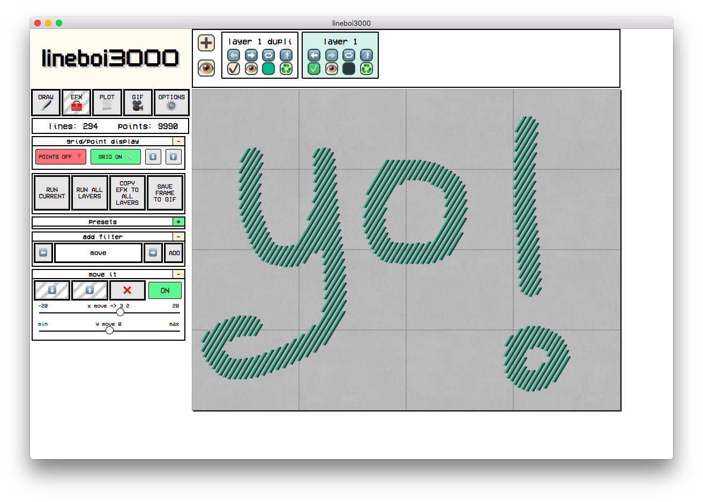
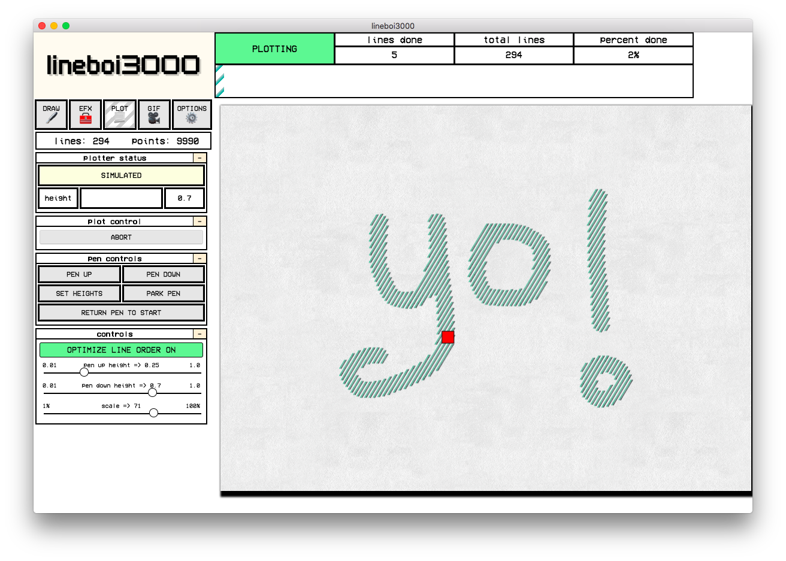
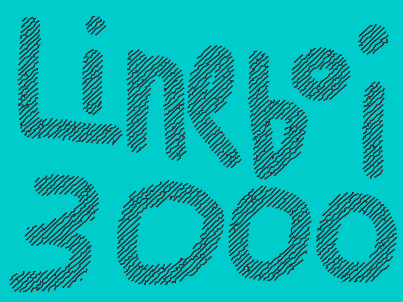
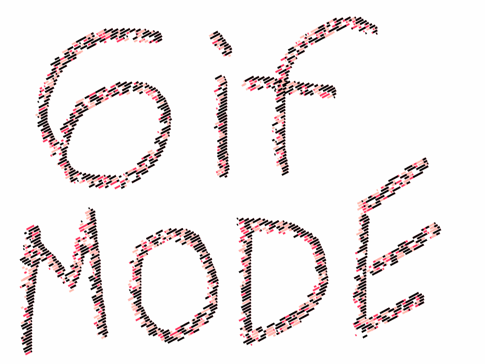

### **lineboi3000 is a way cool graphical interface for drawing, painting, adding EFX, and then sending your designs to a pen plotter or creating animations.**

## Getting Started

### Install

`yarn` or `npm i` to install all dependencies

### Run The App

`yarn dev` or `npm dev` to run the dev server (devtools open, and Webpack rebuilds on changes to files)

## Full documentation lives [HERE](http://username.github.io/repository)

