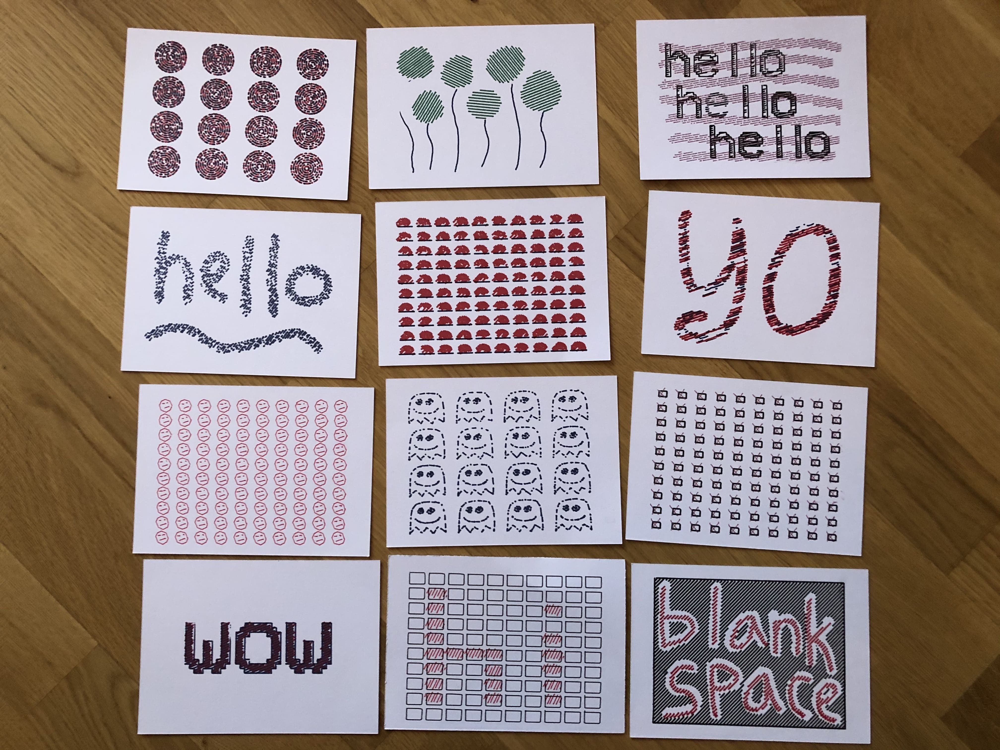
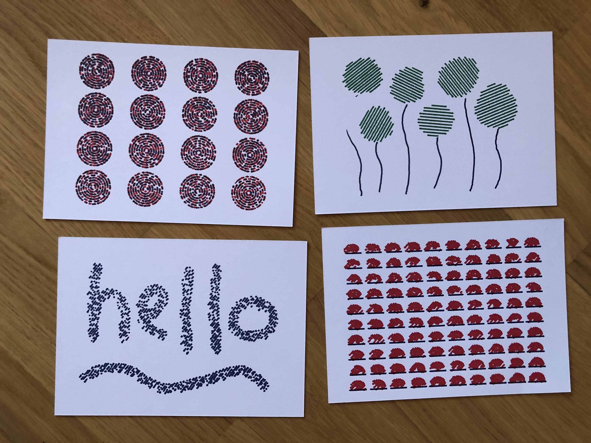
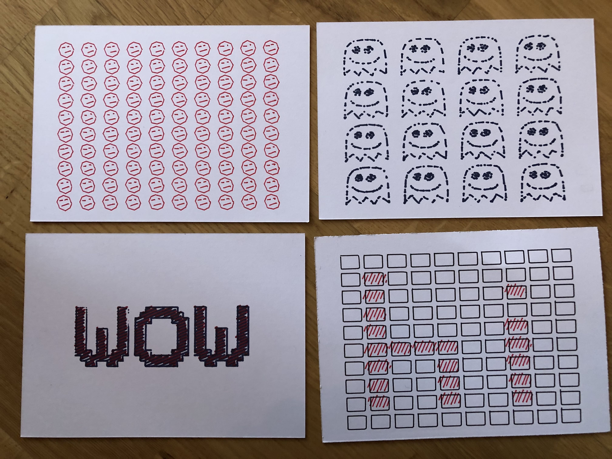
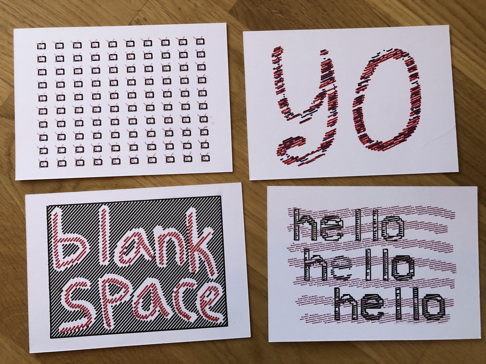

### **lineboi3000 is a way cool graphical interface for drawing, painting, adding EFX, and then sending your designs to a pen plotter or creating animations.**

# **[Click Here For Full Documentation](https://lilkraftwerk.github.io/lineboi3000/)**

## Quick Start

### Install

Clone the repo, CD to the dir, and then `yarn` or `npm i` to install all dependencies

### Run The App

`yarn dev` or `npm dev` to run the dev server (devtools open, and Webpack rebuilds on changes to files)

## Questions, Comments, Etc.

Open an issue or tweet me: [@nah_solo](https://twitter.com/nah_solo)

## Finished Plotted Artwork

All of these postcards were 100% created in and plotted from lineboi3000, on an Axidraw pen plotter.

## Examples

