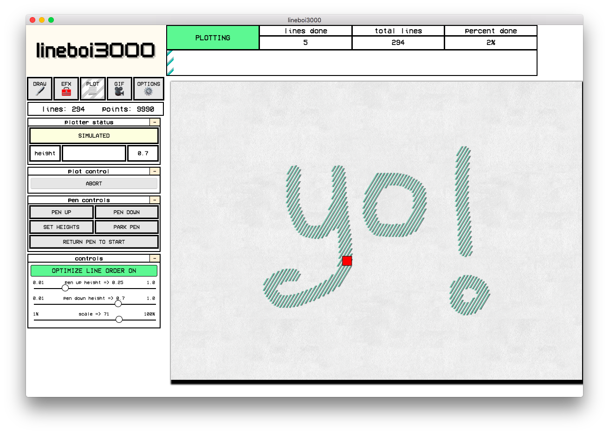

### **lineboi3000 is a way cool graphical interface for drawing, painting, adding EFX, and then sending your designs to a pen plotter or creating animations.** {docsify-ignore}

BETA

## Table O' Contents

-   [Getting Started](getting-started.md)
-   [Modes / Workflow](modes.md)
    -   [Draw Mode](draw-mode.md)
    -   [Efx Mode](efx-mode.md)
    -   [Plot Mode](plot-mode.md)
    -   [Gif Mode](gif-mode.md)
    -   [Options Mode](options-mode.md)

*   [Participating](contributing.md)
*   [Thanks U](thanks.md)
*   [License](license.md)

